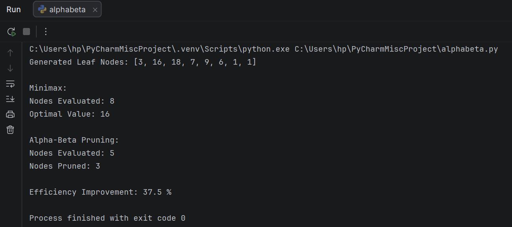
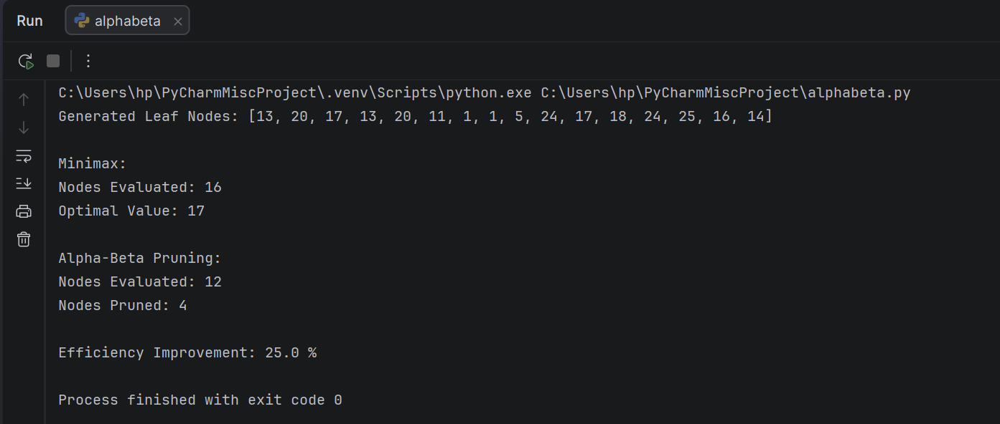

# Implementation and Performance Comparison of Minimax and Alpha-Beta Pruning Algorithms

Implementation and Performance Comparison of Minimax and Alpha-Beta Pruning Algorithms Using a Random Binary Game Tree.

---

# 🎯 Objectives

The objectives of this project are:

- To understand the working process of the Minimax algorithm.
- To implement Alpha-Beta Pruning as an optimization technique.
- To generate a random binary game tree with leaf node scores.
- To compare the performance of Minimax and Alpha-Beta Pruning.
- To calculate the efficiency improvement achieved by Alpha-Beta Pruning.

---

# 📝 Problem Statement

In Artificial Intelligence, game-playing agents need to make optimal decisions by exploring possible future states. The Minimax algorithm is widely used for this purpose, but it becomes inefficient for large game trees because it evaluates every possible node.

Alpha-Beta Pruning improves the Minimax algorithm by eliminating branches that cannot affect the final decision.

In this project, both algorithms are applied to the same randomly generated binary game tree to determine the optimal value. The program also counts evaluated nodes, pruned nodes, and calculates the efficiency improvement of Alpha-Beta Pruning compared to Minimax.

---

# 🧠 Algorithms Used

## 1. Minimax Algorithm

Minimax is a recursive decision-making algorithm used in two-player games.

- The **MAX player** tries to maximize the score.
- The **MIN player** tries to minimize the score.
- The algorithm explores the complete game tree and returns the optimal value.

### Working Steps:

1. Start from the root node.
2. Recursively explore child nodes.
3. MAX selects the maximum value.
4. MIN selects the minimum value.
5. Return the optimal decision value.

---

## 2. Alpha-Beta Pruning Algorithm

Alpha-Beta Pruning is an optimization technique applied to the Minimax algorithm.

It reduces unnecessary calculations by ignoring branches that cannot influence the final result.

### Working Steps:

1. Maintain two values:
   - Alpha: Best value found by MAX player.
   - Beta: Best value found by MIN player.
2. Evaluate child nodes recursively.
3. Update alpha and beta values.
4. Prune unnecessary branches when:

```
Beta <= Alpha
```

5. Return the optimal value.

---

# ⚙️ Implementation Details

## Programming Language

- Python 3

## Libraries Used

| Library | Purpose |
|---------|---------|
| random | Generate random leaf node values |
| math | Calculate tree depth |

## Tree Configuration

- Binary game tree
- Randomly generated leaf node scores
- Supports 8 and 16 leaf nodes
- Automatic tree depth calculation

---

# 📂 Project Structure

```
Minimax-AlphaBeta-Pruning/
│
├── minimax_alpha_beta.py      # Main Python implementation
│
├── README.md                  # Project documentation
│
└── screenshots/               # Output screenshots
    │
    ├── test_case_1.png
    │
    └── test_case_2.png
```

---

# 💻 Source Code Implementation

The complete implementation of Minimax and Alpha-Beta Pruning algorithms is written in Python.

The source code is available here:

[Click here to view Python Implementation](alphabeta.py)

---

# ▶️ How to Run the Project

### Step 1: Clone the repository

```bash
git clone https://github.com/yourusername/Minimax-AlphaBeta-Pruning.git
```

### Step 2: Open the project folder

```bash
cd Minimax-AlphaBeta-Pruning
```

### Step 3: Run the Python program

```bash
python minimax_alpha_beta.py
```

---

# 🧪 Test Results

The program was tested using randomly generated binary game trees. Both Minimax and Alpha-Beta Pruning algorithms were executed on the same tree.

---

# Test Case 1

## Generated Leaf Nodes

```
[3, 16, 18, 7, 9, 6, 1, 1]
```

## Minimax Result

| Parameter | Value |
|-----------|-------|
| Nodes Evaluated | 8 |
| Optimal Value | 16 |

## Alpha-Beta Pruning Result

| Parameter | Value |
|-----------|-------|
| Nodes Evaluated | 5 |
| Nodes Pruned | 3 |
| Optimal Value | 16 |

## Efficiency Improvement

```
37.5%
```

### Output Screenshot



---

# Test Case 2

## Generated Leaf Nodes

```
[13, 20, 17, 13, 20, 11, 1, 1, 5, 24, 17, 18, 24, 25, 16, 14]
```

## Minimax Result

| Parameter | Value |
|-----------|-------|
| Nodes Evaluated | 16 |
| Optimal Value | 17 |

## Alpha-Beta Pruning Result

| Parameter | Value |
|-----------|-------|
| Nodes Evaluated | 12 |
| Nodes Pruned | 4 |
| Optimal Value | 17 |

## Efficiency Improvement

```
25%
```

### Output Screenshot



---

# 📈 Efficiency Calculation

The efficiency improvement is calculated using:

```
Efficiency Improvement =
((Minimax Nodes Evaluated - Alpha-Beta Nodes Evaluated)
 / Minimax Nodes Evaluated) × 100
```

---

# 💡 Discussion and Conclusion

In this project, Minimax and Alpha-Beta Pruning algorithms were implemented and compared using the same binary game tree.

Both algorithms produced the same optimal value, which proves that Alpha-Beta Pruning improves the performance without changing the final decision.

Minimax evaluates all possible nodes, which increases computation time for larger trees. Alpha-Beta Pruning reduces unnecessary calculations by removing branches that do not affect the final result.

Therefore, Alpha-Beta Pruning is a more efficient approach for solving large search problems in Artificial Intelligence.

---

# 🚀 Future Improvements

Possible improvements include:

- Adding graphical visualization of the game tree.
- Comparing execution time between algorithms.
- Supporting different tree sizes.
- Adding heuristic evaluation functions.

---

# 👨‍💻 Author

**Md. Julfikar Alam**
Student of GUB
Department of Computer Science and Engineering
